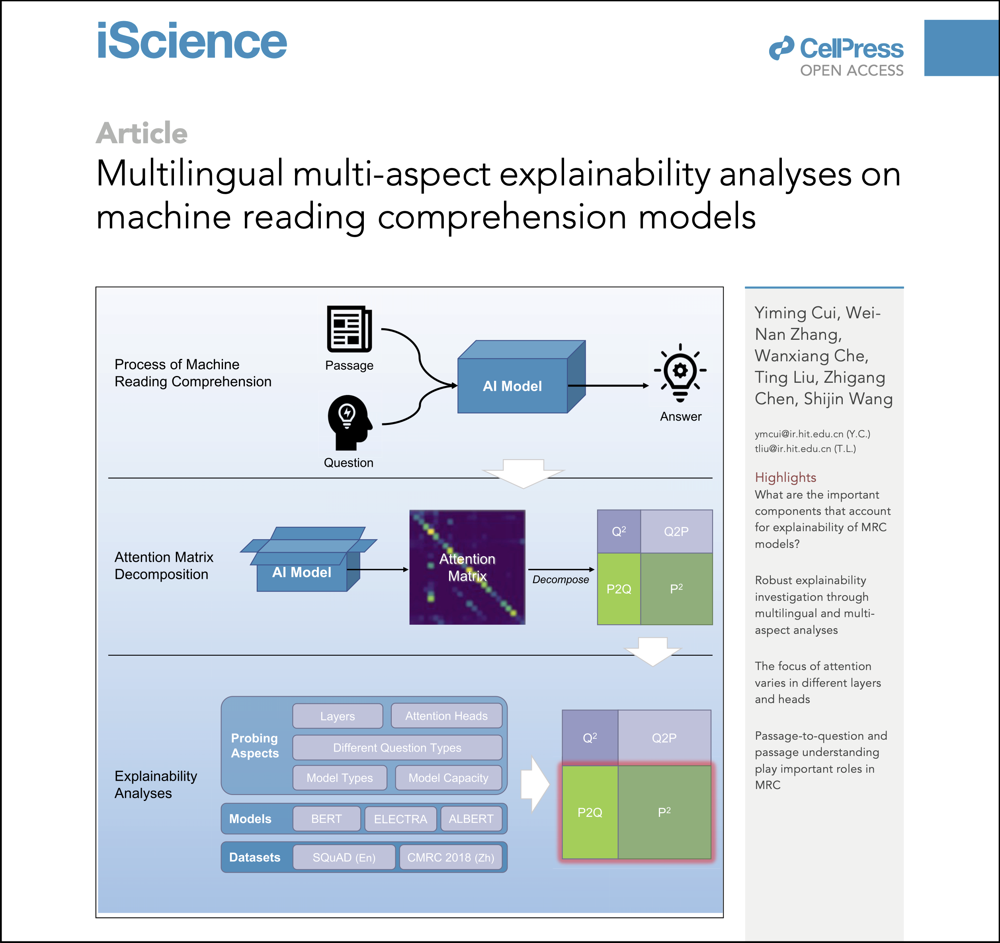

# MRC-Model-Analysis
This repository contains source code for our paper "Multilingual Multi-Aspect Explainability Analyses on Machine Reading Comprehension Models" (formerly "Understanding Attention in Machine Reading Comprehension. https://arxiv.org/abs/2108.11574v1").

- [**Multilingual Multi-Aspect Explainability Analyses on Machine Reading Comprehension Models**](https://www.cell.com/iscience/fulltext/S2589-0042(22)00446-1)
  - Yiming Cui, Wei-Nan Zhang, Wanxiang Che, Ting Liu, Zhigang Chen, Shijin Wang
  - Published in *iScience*, Cell Press 

**(new)** If you would like to know how to visualize attention zones, we have a step-by-step protocol for your perusal.

- [**Visualizing attention zones in machine reading comprehension models**](https://star-protocols.cell.com/protocols/1736)
  - Yiming Cui, Wei-Nan Zhang, Ting Liu
  - Published in *STAR Protocols*, Cell Press

<p align="center">
    <br>
    
    <br>
</p>

## Requirements
```
Python 3.7.3
TensorFlow 1.15.3
```

Note:

1. All experiments are carried out using TPU. If you are using other training devices, please adjust these scripts accordingly. 
2. The script might also work under TensorFlow 1.13 ~ 1.15.

### How to run SQuAD baseline (TPU)
Run the following script (`train_squad.sh`) with proper replacement of a few pre-defined variables.
```bash
GS_BUCKET=gs://your-bucket
TPU_NAME=your-tpu-name
TPU_ZONE=your-tpu-zone
MODEL_OUTPUT_DIR=$GS_BUCKET/path-to-output-dir
python -u run_squad.py \
  --vocab_file=$GS_BUCKET/bert/cased_L-12_H-768_A-12/vocab.txt \
  --bert_config_file=$GS_BUCKET/bert/cased_L-12_H-768_A-12/bert_config.json \
  --init_checkpoint=$GS_BUCKET/bert/cased_L-12_H-768_A-12/bert_model.ckpt \
  --do_train=True \
  --train_file=./squad/train-v1.1.json \
  --do_predict=True \
  --predict_file=./squad/dev-v1.1.json \
  --train_batch_size=64 \
  --predict_batch_size=32 \
  --num_train_epochs=3.0 \
  --max_seq_length=512 \
  --doc_stride=128 \
  --learning_rate=3e-5 \
  --version_2_with_negative=False \
  --output_dir=$MODEL_OUTPUT_DIR \
  --do_lower_case=False \
  --use_tpu=True \
  --tpu_name=$TPU_NAME \
  --tpu_zone=$TPU_ZONE
```

1. Put pre-trained BERT checkpoint in `bert` directory. Note that TPU requires a Google Cloud Storage bucket to save/load model files, which is different from local file system. If you are using GPU/CPU, please ignore $GS_BUCKET variable and just point your local file path.
   - File download: https://storage.googleapis.com/bert_models/2018_10_18/cased_L-12_H-768_A-12.zip
   - **WARNING**: A Google Cloud Storage bucket (path start with `gs://`) is **mandatory** when using TPU.
   - `$TPU_NAME` and `$TPU_ZONE`are the TPU information (created by using `ctpu` or `gcloud compute` commands).
2. Download SQuAD (v1.1) train/dev files: 

   - Train: https://rajpurkar.github.io/SQuAD-explorer/dataset/train-v1.1.json

   - dev: https://rajpurkar.github.io/SQuAD-explorer/dataset/dev-v1.1.json
3. Put SQuAD train/dev files in `squad` directory:
   - `mkdir squad && mv train-v1.1.json dev-v1.1.json squad`


### How to run CMRC 2018 baseline (TPU)
Run the following script (`train_cmrc2018.sh`) with proper replacement of a few pre-defined variables.
```bash
GS_BUCKET=gs://your-bucket
TPU_NAME=your-tpu-name
TPU_ZONE=your-tpu-zone
MODEL_OUTPUT_DIR=$GS_BUCKET/path-to-output-dir
python -u run_cmrc2018.py \
  --vocab_file=$GS_BUCKET/bert/chinese_L-12_H-768_A-12/vocab.txt \
  --bert_config_file=$GS_BUCKET/bert/chinese_L-12_H-768_A-12/bert_config.json \
  --init_checkpoint=$GS_BUCKET/bert/chinese_L-12_H-768_A-12/bert_model.ckpt \
  --do_train=True \
  --train_file=./cmrc2018/cmrc2018_train.json \
  --do_predict=True \
  --predict_file=./cmrc2018/cmrc2018_dev.json \
  --train_batch_size=64 \
  --predict_batch_size=32 \
  --num_train_epochs=2 \
  --max_seq_length=512 \
  --doc_stride=128 \
  --learning_rate=3e-5 \
  --do_lower_case=True \
  --output_dir=$MODEL_OUTPUT_DIR \
  --use_tpu=True \
  --tpu_name=$TPU_NAME \
  --tpu_zone=$TPU_ZONE
```

1. Put pre-trained BERT checkpoint in `bert` directory. Note that TPU requires a Google Cloud Storage bucket to save/load model files, which is different from local file system. If you are using GPU/CPU, please ignore $GS_BUCKET variable and just point your local file path.

   - File download: https://storage.googleapis.com/bert_models/2018_11_03/chinese_L-12_H-768_A-12.zip

   - **WARNING**: A Google Cloud Storage bucket (path start with `gs://`) is **mandatory** when using TPU.
   - `$TPU_NAME` and `$TPU_ZONE`are the TPU information (created by using `ctpu` or `gcloud compute` commands).

2. Download CMRC 2018 train/dev file:
   - https://github.com/ymcui/cmrc2018/tree/master/squad-style-data

3. Put CMRC 2018 train/dev files in `cmrc2018` directory
   - `mkdir cmrc2018 && mv train-v1.1.json dev-v1.1.json cmrc2018`


### How to mask attention zones 

Simply pass an additional argument `--mask_zone` and `--mask_layer` to `run_squad.py` or `run_cmrc2018.py` script when decoding.

#### `--mask_zone` argument

The followings are valid values for `--mask_zone`:

- "q2": masking Q2 zone
- "q2p": masking Q2P zone
- "p2q": masking P2Q zone
- "p2": masking P2 zone
- "all": masking all zones

#### `--mask_layer` argument

Specify which layer should be masked. The starting index is 0. For example, in BERT-base, the index for the first transformer layer is `0` and the last is `11`.


### Visualization (new)

Please consult our detailed protocol that was published in STAR Protocols. The presented protocol provides a step-by-step guideline on how to visualize attention zones in machine reading comprehension models.

See: [**Visualizing attention zones in machine reading comprehension models**](https://star-protocols.cell.com/protocols/1736)

<p align="center">
    <br>
    
    <br>
</p>

## Citation

If your find our work helpful, please consider cite our paper.

```bibtex
@article{cui-etal-2022-mrc,
      title = {Multilingual Multi-Aspect Explainability Analyses on Machine Reading Comprehension Models},
      author = {Cui, Yiming and Zhang, Wei-Nan and Che, Wanxiang and Liu, Ting and Chen, Zhigang and Wang, Shijin},
      journal = {iScience},
      volume = {25},
      number = {5},
      pages = {104176},
      year = {2022},
      issn = {2589-0042},
      doi = {https://doi.org/10.1016/j.isci.2022.104176},
      url = {https://www.sciencedirect.com/science/article/pii/S2589004222004461},
}
```

Also, if you find our step-by-step protocol useful, please cite the following paper.
```
@article{cui-2022-mrc-protocol,
title = {Visualizing attention zones in machine reading comprehension models},
journal = {STAR Protocols},
volume = {3},
number = {3},
pages = {101481},
year = {2022},
issn = {2666-1667},
doi = {https://doi.org/10.1016/j.xpro.2022.101481},
author = {Yiming Cui and Wei-Nan Zhang and Ting Liu},
}
```

## Zenodo Archive
[](https://zenodo.org/badge/latestdoi/463023018)
